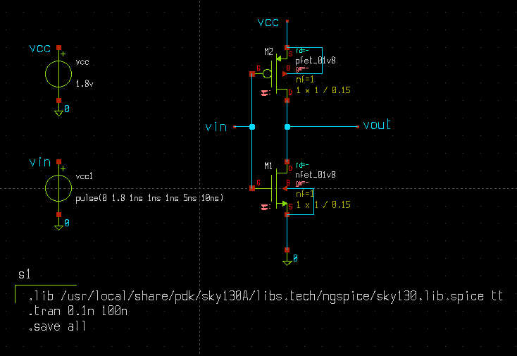
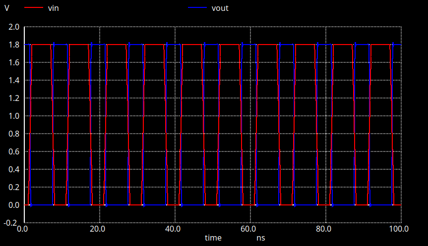
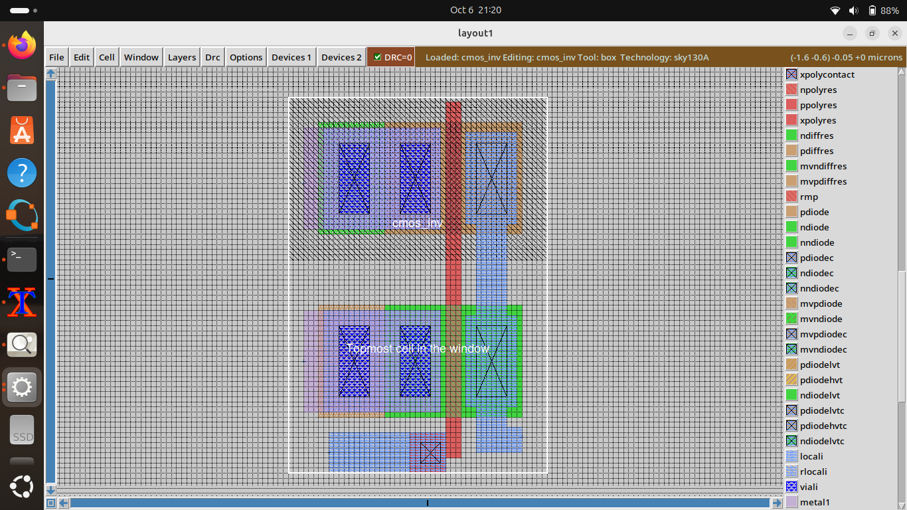

# CMOS Inverter — Xschem, NGSpice & Magic

A CMOS inverter designed using **Xschem**, simulated using **NGSpice**, and laid out using **Magic VLSI** with the **Sky130 PDK**.

## Overview

The CMOS inverter consists of a **PMOS** and **NMOS** transistor connected in a complementary configuration. The circuit demonstrates the basic operation of a CMOS logic inverter, where the output is the logical complement of the input.

The project covers the complete flow from **schematic design and circuit simulation to physical layout**.

## Tools Used

* **Xschem** — Schematic design
* **NGSpice** — Circuit simulation
* **Magic VLSI** — Physical layout and DRC
* **Sky130 PDK** — CMOS device models and layout rules
* **Ubuntu Linux** — Development environment

## Files

| File                  | Description                |
| --------------------- | -------------------------- |
| `cmos_inv.sch`        | Xschem circuit schematic   |
| `cmos_inv.spice`      | NGSpice simulation netlist |
| `cmos_inv.mag`        | Magic VLSI layout          |
| `xschemrc`            | Xschem configuration       |
| `Circuit_Diagram.png` | Circuit schematic image    |
| `Output_Waveform.png` | Simulation output waveform |
| `Layout.png`          | Magic VLSI layout image    |

## Circuit Diagram



## Simulation Result

The transient simulation demonstrates the inverter's switching behavior, with the output voltage responding inversely to the input voltage.



## Magic VLSI Layout

The physical layout of the CMOS inverter was created using **Magic VLSI** with the **Sky130 PDK**.



## Simulation Flow

```text
Xschem
   ↓
Schematic Design
   ↓
NGSpice Netlist
   ↓
Transient Simulation
   ↓
Output Waveform
   ↓
Magic VLSI
   ↓
Physical Layout
   ↓
DRC Verification
```

---

**Tools:** `Xschem` · `NGSpice` · `Magic VLSI` · `Sky130 PDK`
