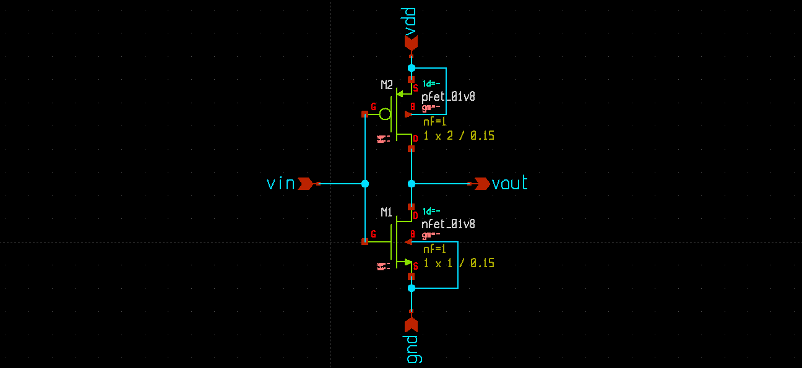
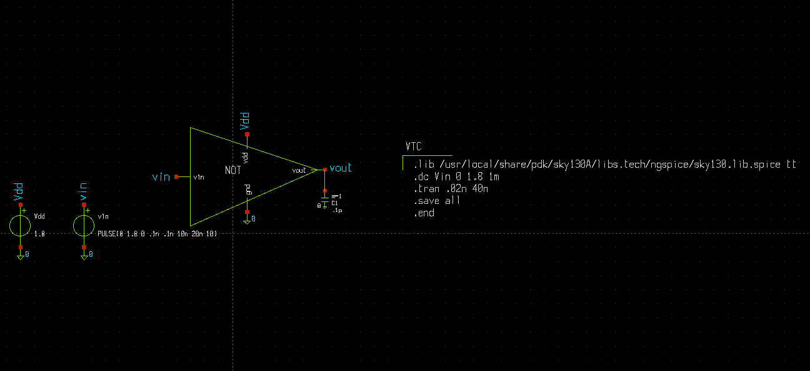
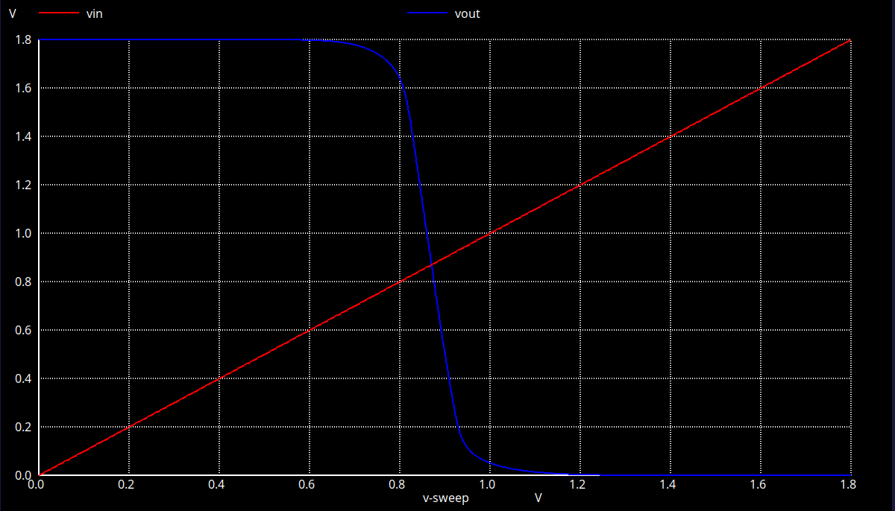

# CMOS Inverter VTC — Xschem & NGSpice

A CMOS inverter designed and simulated using **Xschem**, **NGSpice**, and the **Sky130 PDK**. This project focuses on analyzing the Voltage Transfer Characteristics (VTC) of a CMOS inverter.

## Description

A CMOS inverter is a fundamental digital logic circuit consisting of a PMOS and an NMOS transistor connected in a complementary configuration.

The inverter produces an output opposite to its input:
- When the input is LOW, the output is HIGH.
- When the input is HIGH, the output is LOW.

The VTC curve illustrates the relationship between the input voltage (Vin) and the output voltage (Vout), helping us understand the switching behavior of the inverter.

## Circuit Schematic

The schematic shows the CMOS inverter circuit designed using Xschem.

## CMOS Inverter Symbol

The symbol represents the CMOS inverter as a logic gate, with one input and one inverted output.

## Voltage Transfer Characteristics (VTC)

The VTC plot shows the output voltage (Vout) as a function of the input voltage (Vin).

### Key Observations

- **Logic LOW Input:** The PMOS transistor is ON, and the NMOS transistor is OFF, producing a HIGH output.
- **Logic HIGH Input:** The PMOS transistor is OFF, and the NMOS transistor is ON, producing a LOW output.
- **Switching Region:** Both transistors conduct around the transition region, causing the output voltage to change rapidly.
- **Voltage Gain:** The steepness of the VTC curve in the switching region indicates the inverter's voltage gain.

## Tools & Technologies

- **Xschem** — Circuit schematic design
- **NGSpice** — Circuit simulation and VTC analysis
- **Sky130 PDK** — CMOS transistor models and process design kit
- **Ubuntu Linux** — Development environment
