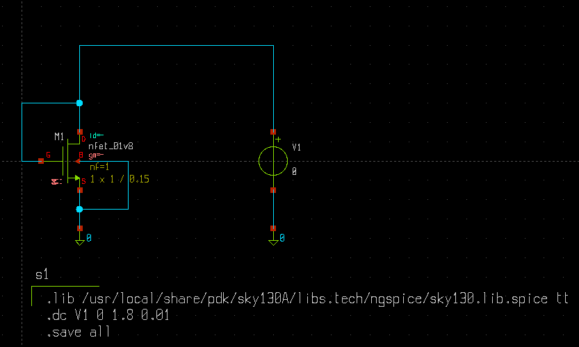
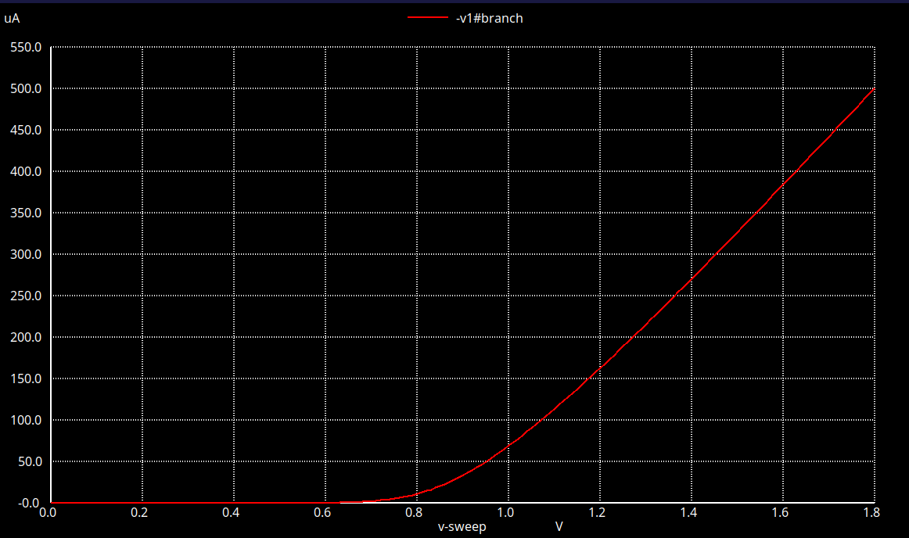

# NMOS as Diode — Xschem & NGSpice

An NMOS transistor configured as a **diode-connected device** using **Xschem** and simulated using **NGSpice** with the **Sky130 PDK**.

## Overview

The NMOS is configured as a diode by connecting its **gate and drain together**. The source and bulk are connected to ground. This configuration is used to study the nonlinear I-V characteristics of an NMOS transistor.

## Tools Used

* **Xschem** — Schematic design
* **NGSpice** — Circuit simulation
* **Sky130 PDK** — CMOS device models
* **Ubuntu Linux** — Development environment

## Files

| File                  | Description                  |
| --------------------- | ---------------------------- |
| `nmos_diode.sch`      | Xschem circuit schematic     |
| `nmos_diode.spice`    | NGSpice simulation netlist   |
| `Circuit_Diagram.png` | Circuit schematic image      |
| `Output_Waveform.png` | Simulation output waveform   |

## Circuit Diagram



## Simulation Result

A DC sweep is performed by varying the input voltage from **0 V to 1.8 V**. The simulation demonstrates the nonlinear current-voltage characteristics of the diode-connected NMOS.



## Simulation Flow

```text
Xschem
   ↓
Schematic Design
   ↓
NGSpice Netlist
   ↓
DC Sweep Simulation
   ↓
I-V Characteristics
