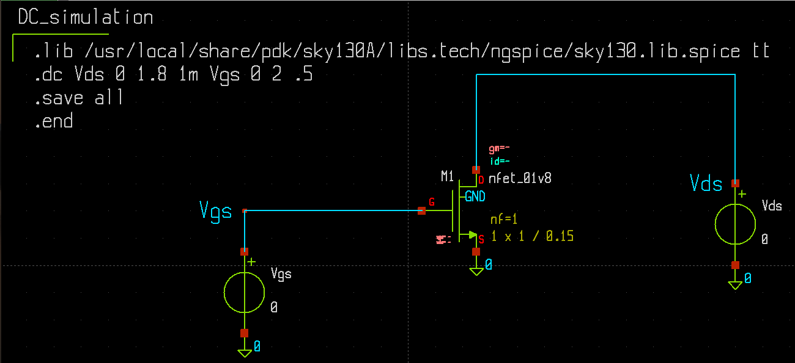
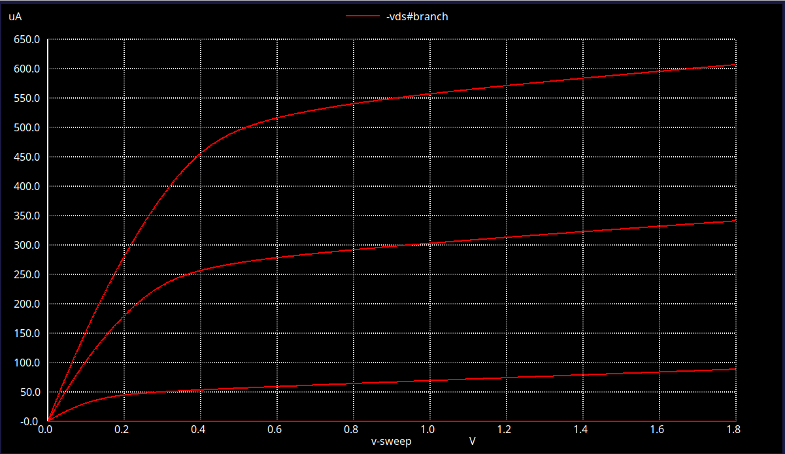

# NMOS DC Analysis — Xschem & NGSpice

An **NMOS transistor DC analysis** designed using **Xschem** and simulated using **NGSpice** with the **Sky130 PDK**.

## Overview

This project analyzes the DC characteristics of an NMOS transistor by sweeping the transistor voltages and observing its output characteristics.

The simulation demonstrates the relationship between **drain current (Id)** and **drain-source voltage (Vds)** for different **gate-source voltages (Vgs)**.

## Tools Used

* **Xschem** — Schematic design
* **NGSpice** — DC simulation
* **Sky130 PDK** — NMOS device model
* **Ubuntu Linux** — Development environment

## Files

| File                         | Description                 |
| ---------------------------- | --------------------------- |
| `dc_sweep.sch`               | Xschem circuit schematic    |
| `dc_sweep.spice`             | NGSpice simulation netlist  |
| `Circuit_Diagram.png`        | Circuit schematic image     |
| `Output_Characteristics.png` | NMOS output characteristics |

## Circuit Diagram



## Simulation Result

The DC sweep produces the **NMOS output characteristics**, showing the variation of drain current with drain-source voltage for different gate-source voltage values.



## Simulation Flow

```text
Xschem
   ↓
NMOS Schematic
   ↓
NGSpice DC Sweep
   ↓
Id–Vds Characteristics
```


**Tools:** `Xschem` · `NGSpice` · `Sky130 PDK`
